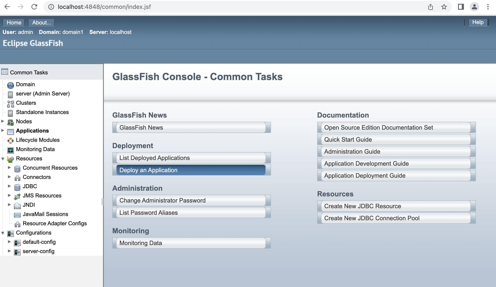

# Beispiel RESTful API mit JAX-RS

Um eine RESTful API mit JAX-RS gut entwickeln zu können, sollte man eine Entwicklungsumgebung einrichten. In diesem Runbook ist die Einrichtung einer solchen beschrieben.

## Einrichten der Umgebung

1. Installieren Sie ein **Java Development Kit (JDK)** in einer aktuellen Version. Um zu überprüfen, ob die Installation erfolgreich war, können Sie folgenden Befehl verwenden:

    ```bash
    java --version 
    ```

2. Laden Sie sich einen aktuellen **JakartaEE Container** (z.B. Glassfish [https://glassfish.org](https://glassfish.org)) herunter und entpacken Sie das ZIP File auf Ihrem System an geeigneter Stelle. Je nach Betriebssystem können Sie dafür den Paketmanager verwenden. Hier entpacken wir dieses ZIP File einfach in dem Unterordner, in dem sich diese Datei befindet. Die Dateistruktur  muss wie folgt aussehen:

    ```bash
    demo
    |- glassfish6
        |- bin
        |- glassfish
        |- javadb
        |- META-INF
        |- mq
    |- pizza
        |- src
        |- pom.xml
    |- steam
        |- src
        |- pom.xml
    |- README.md
    ```

3. Setzen Sie mit dem folgenden Befehl den Zugriffsmodus des Adminskriptes von Glassfish auf "Ausführen".

    ```bash
    chmod +x glassfish/bin/asaadmin
    ```

4. Starten Sie Glassfish:

    ```bash
    ./glassfish6/bin/asadmin start-domain
    ````
    Starten Sie Glassfish im debug Modus:
    ```
    ./glassfish6/bin/asadmin start-domain -v (--verbose)
    ```

    Wenn Sie Glassfish stoppen möchten, verwenden Sie folgenden Befehl:

    ```bash
    ./glassfish6/bin/asadmin stop-domain
    ```

5. Stellen Sie sicher, dass Sie die Weboberfläche von Glassfish erreichen können, in dem Sie folgende Webseite in Ihrem Browser öffnen: [http://localhost:4848](http://localhost:4848)

    

## Einrichten eines JAX-RS Projektes

Ein Beispiel-Projekt (zum Thema Steam) finden Sie im Ordner "steam".

Das Beispiel-Projekt wurde mit dem Software-Project-Managment Tool [Maven](https://maven.apache.org/) erstellt. Dieses Tool können Sie entweder manuell oder je nach Betriebssystem mit dem integrierten Paketmanager installieren.

Wechseln Sie zunächst mit der Konsole in den steam Ordner:

```bash
cd steam
```

Dort befindet sich die Projekt-Datei, die sogenannte **Project-Object-Model** [pom.xml](steam/pom.xml), die die wichtigsten Projekteinstellungen (z.B. Projektnamen, Java Version, Abhängigkeiten und Deployment-Konfigurationen) enthält. Führt man Maven in einem Ordner mit einer pom.xml Datei aus, wird diese automatisch von Maven eingelesen.


### Wichtigste Maven Befehle

Maven bietet weit mehr Funktionen als wir in diesem Projekt benötigen. Daher folgt hier eine Liste mit den wichtigsten Befehlen. 

1.  Installation und Java Konfiguration überprüfen:
    ```bash
    mvn --version
    ```

2. Installation aller Abhängigkeiten
    ```bash
    mvn clean install
    ```

3. Kompilieren eines Projektes
    ```bash
    mvn package
    ```
    Dieser Befehl führt zudem automatisch alle Tests aus. Mit dem Parameter `-DskipTests=true` kann dies deaktiviert werden. Dieser Befehl erstellt einen neuen target-Ordner, in dem das Ergebnis des Kompilierens abgelegt wird.

4. Um die Anwendung in dem zuvor eingerichteten Servlet-Container bereitzustellen, kann folgender Maven-Befehl verwendet werden:
    ```bash
    mvn cargo:deploy
    ```

    Um eine bereits bereitgestellte Anwendung zu aktualisieren kann folgender Befehl verwendet werden:
    ```bash
    mven cargo:redeploy
    ````

5. Alle wichtigten Schritte (Testen, Kompilieren, Bereitstellen) können auch hintereinander mit folgendem Kommando ausgeführt werden:
    ```bash
    mvn package cargo:redeploy
    ```

## Kontrolle

Wenn alle Schritte erfolgreich ausgeführt wurden, können Sie unter [http://localhost:8080/steam](http://localhost:8080/steam) auf die Anwendung zugreifen.